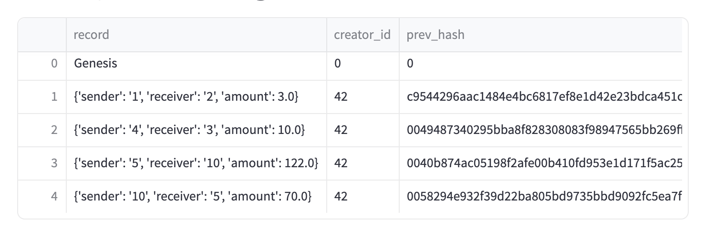
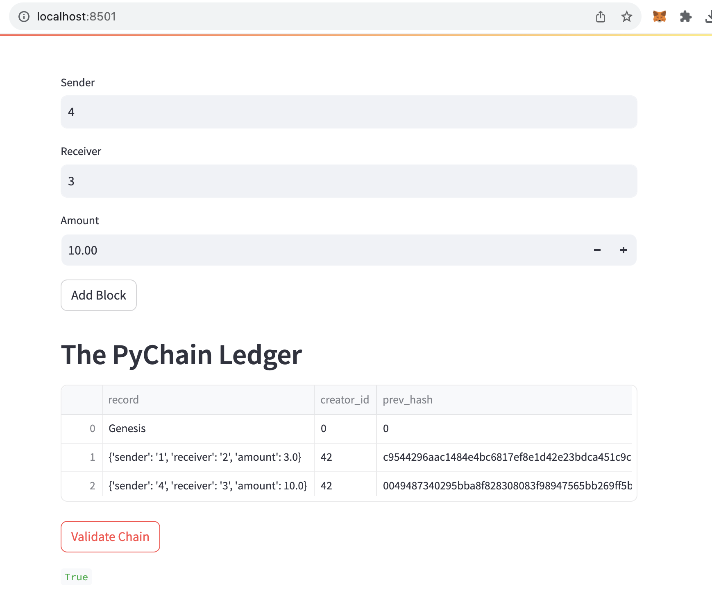

# Module18Challenge
# PyChain Ledger

## Overview

This project is a basic implementation of a blockchain ledger, named PyChain. The application uses Python and Streamlit to allow users to add transaction records to the blocks. It also includes functionalities to perform the Proof-of-Work algorithm and to validate the blockchain.

## How to Use

1. After launching the Streamlit app, input the details for the sender, receiver, and amount for the transaction.

2. Click the "Add Block" button to add the transaction record to the blockchain.

3. You can inspect individual blocks and check the validity of the entire blockchain using the Streamlit sidebar options.

## Screenshots

### Adding Blocks to the PyChain Ledger

### Validating the Blockchain

